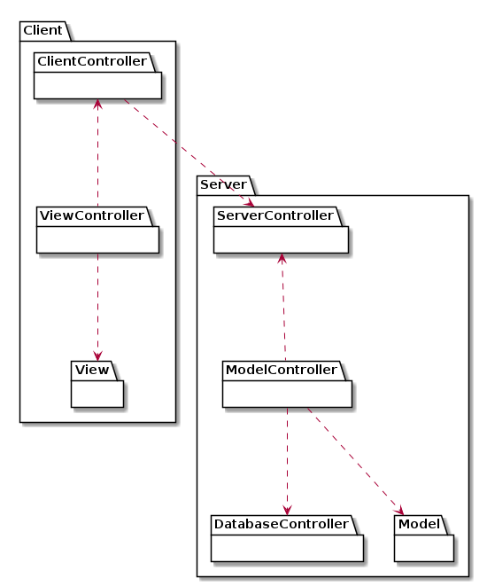
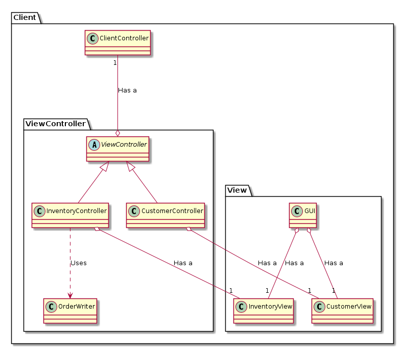
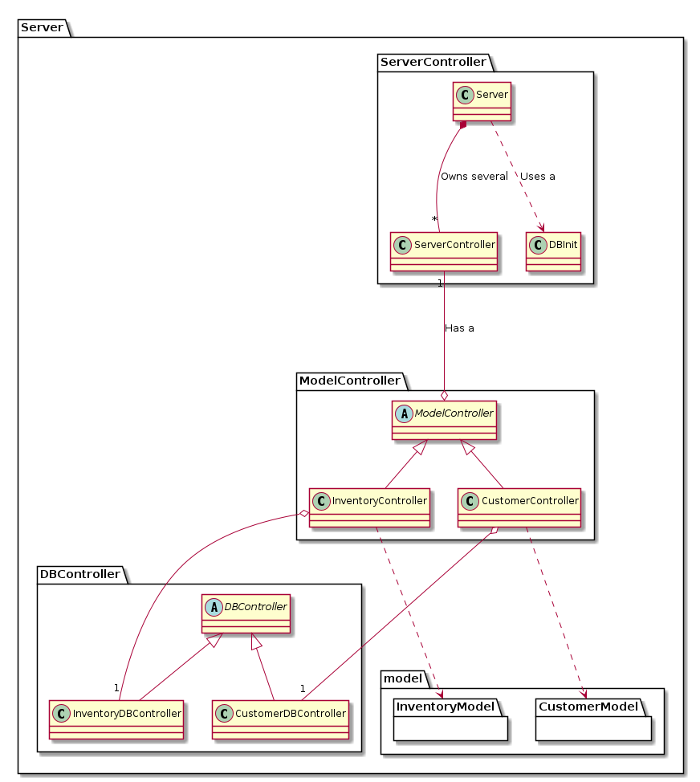
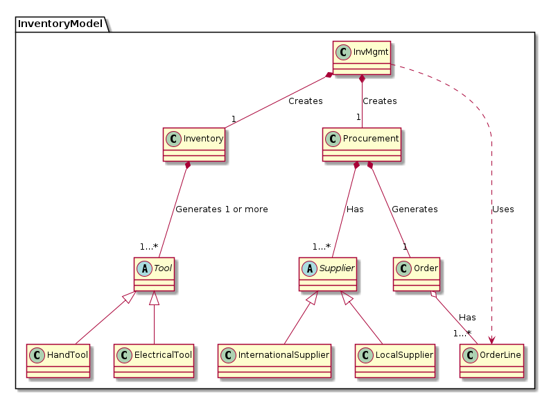
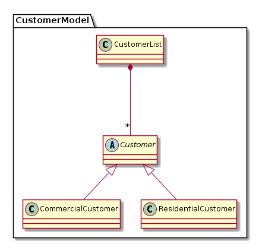

# ENSF 607 - Final Project - UML Diagrams
### By: Michael Lasby & Tong Xu
### Submitted: November 18, 2020

## Summary
Please find enclosed five (5) UML model diagrams for our ToolShop Application design. The diagrams include both high level and low level models to ensure each diagram is easily understandable and concise. 

Please note that we intend to use the JSON to pass data between the server and client; therefore, no client side model or serialization helper classes are required.

The diagrams are presented below in order of high level to low level. 

## Package Diagram

## Client Package

## Server Package

## InventoryModel Package

## CustomerModel Package

