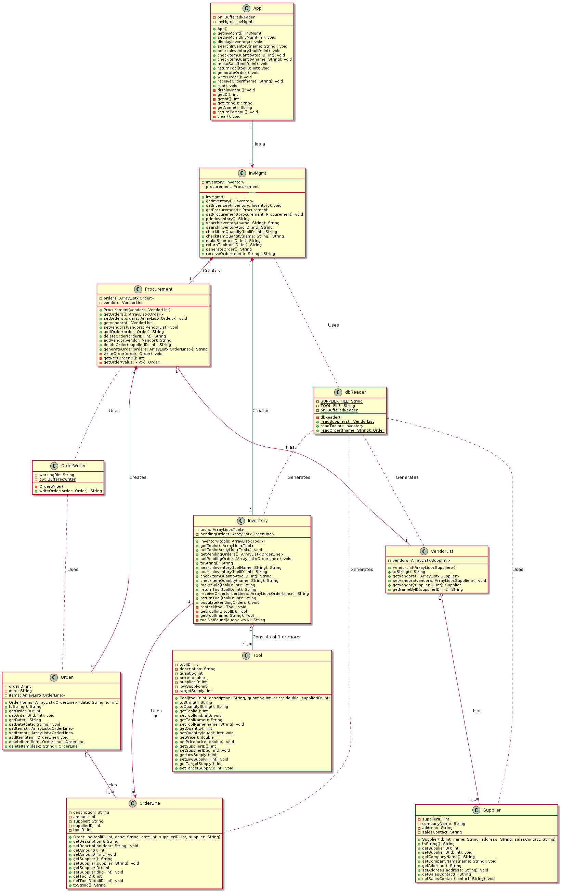

# ENSF 607 - Lab 3
### Oct. 13, 2020
### By: Michael Lasby

 
 

## Retail Store
See `./src/toolshop` for source files and `./docs/toolshop/` for javadocs.

### Changes from Lab 2: 
Minor changes were made to select functions / member variables during development of the applicaiton. Please see the revised UML diagram below which documents these revisions: 

**A 11x17" pdf of the above is in ./lib/toolshop/ which may be easier to read.**

### Compiling and Running: 
To compile the program, please navigate to the lab_3 directory and invoke the following command: `javac -sourcepath . ./src/toolshop/*.java -d ./bin/` and run the program with the command `java -cp ./bin: toolshop.App` **from the `lab_3` directory**. The program uses a relative reference to access the `items.txt` and `suppliers.txt` files stored in `./lib/toolshop/` directory and to write orders out to the directory `./lib/toolshop/orders/`. 

### Feedback from Last Week: 
> Ex3: Rel required btw Supplier & Tool. Inventory should be able to producer Orders, not necessarily OrderLines. Hence, rel btw Inventory & OrderLine could be reduced to dependency.

The above feedback was unfortunately received after I had completed Lab 3. Regardless, my original design was intended to completely decouple the Procurement and Inventory branches of the app. Therefore, Inventory actually doesn't have any relationship with Order. OrderLine instances are a container used to transfer primitive data types between the two branches of the backend to facilitate complete decoupling between the branches and the backend/frontend. 

I completely agree that allowing more coupling between these backend classes greatly simplifies the implementation. But as a challenge, I was attempting to completely decouple as much of the app as possible. 

## Course Registration
See `./src/courseRegistration` for source files. 

Cheers, 
-Mike 